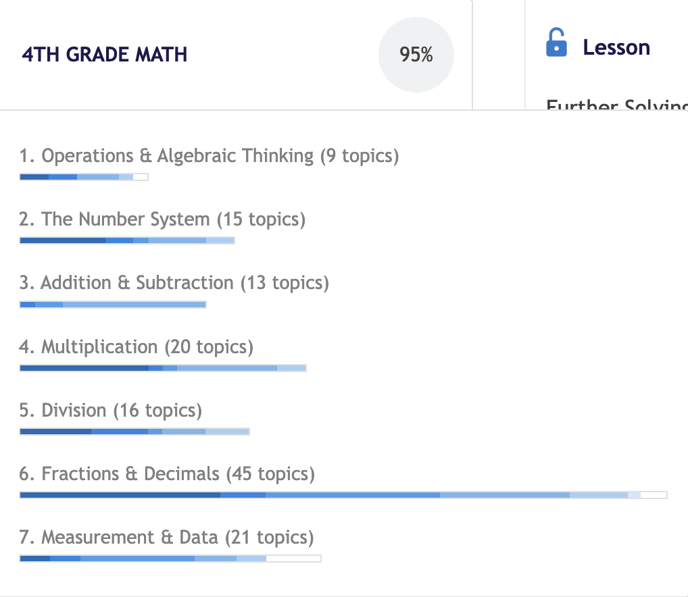

**6:00 AM** - Just woke up. Time to go seize the day - onto the usual morning routine.

**7:27 AM** - Back at the desk now. Finished all the usual morning business.

Today has to be a pretty big day - the family and I are heading on a trip tomorrow to see my grandmother, and so for about six or seven hours I'll be in a car with no access to study tools. That means we have to put in a big effort today.

Going to start a 90-min session now and report right after it. Not feeling super great but not terrible either - I guess I'm just fresh enough to get started.^[While in the shower I daydreamed about all that could happen with my life in the future, and the great things I'd do...having now to sit down and just do 4th grade math is a big change. Not sure if that has to do with it. Don't know that I want to stop dreaming, I'll just have to acknowledge that in some way, *this is the dream*.]

**9:00 AM** - Just wrapped up that 90-min session. Felt good, ended up getting into a rythm after maybe fifteen or twenty minutes. We collected 134 XP on the session (rate of about 89XP/hr) and Math academy says we're about 85% done with the course - I'm hopeful we can finish 4th grade math and make a little dent in 5th grade math by the end of today.

Going to take the dogs out for a quick walk and I'll be back, we'll hit another 90-min session to stack the hours up!.

**9:23 AM** - Back at the desk.

Walking the dogs I got excited thinking about the progress we've made - but more-so about what that means for future progress. I did all these calculations in my head arriving to the conclusion that I may be able to be at pre-calc before the states.

This is a good moment to pause and reflect and remember that progress won't be linear. I won't go through every course at the same speed I'm going at now - and that's also not the goal, the goal is to deeply understand the topics. So I'll really only have to focus on making as big of a dent as I can every day without sacrificing that goal.

Anyways, going to get cranking on another 90-min session. Will report back after.

**11:08 AM** - Just wrapped up another 90-min session (extra time is bathroom + talking with mom). We added 127 XP (rate of 84 XP/hr) and Math academy says we're 95% done with the course.

It slightly worries me that the image which depicts my knowledge^[I think that's what it is] through color gradients doesn't look fully dark yet - I don't know if that means Math academy thinks I don't know the concepts all the way. I also don't know whether that will get fully darkened with the extra 5%, we will see I guess.

I'm going to take a quick break. I need to do two things; I need to pack my bag for the trip and also take my dogs out for their full walk.

I'll go see which of those two I can do, or when I'll do them and I'll report back.

**11:28 AM** - Going to pack my bag now - that'll make sure there's - for the most part - no last minute things I need to do at night, which will serve me good for both the writing time needed for the daily and perhaps some more math grind.

**11:58 AM** - Just finished packing the bag for the trip. It seems that I'll have to help out picking up my sister and taking folks places in the afternoon, so that'll cut the day in bits, but that's okay, we don't live in an isolated cave as much as we'd like to, we do our best with what comes to us. It's good to know in advance though.

Going to get a 60-min session in before lunch at 1 PM. I'll probably be back at the desk close to 4 after that I'd imagine. But we'll cross that bridge when we get there.

**12:59 PM** - Things lined up perfectly because we completed 100% of the course with one-minute to spare for the 60-min session! 4th grade math is officially done.

We added 74 XP on the hour, for a total earned XP of 335 today.

I can't seem to find a breakdown of the 4th grade math course (in terms of total XP and else) but if my mind serves me right, we spent the last three days on it, so about fourteen hours (?)^[I'll check that accuracy later.].

Anyways, going to go have lunch and do the rest of the things I said I needed to do.

I'll check back when I'm at the desk and we can figure out how to tackle the rest of the day.

**4:51 PM** - Made it home about 20 mins ago. Did lunch and then went and picked up sister, drop her off at her friends, picked my mom up, etc... a whole bunch of things really.

Don't really feel like working at math right now, my brain feels kind of foggy, kind of at the brink of headache - it's probably traffic and my own - and others - impatience.

I'm thinking I'm going to try and work at that animation I was playing around with yesterday. Just for a change of pace. I still need to write the daily, so I need to somewhat clear my head before then.

I'm still thinking whether I'll stay up late tonight or not - it's a possibility since there's a six-hour trip tomorrow in which I could just sleep. But we'll figure that out a bit later.

**6:49 PM** - Finished the animation. Doesn't look exactly like I imagined it, but it does a fair job. Still relied on AI^[Claude is my guy, if you were wondering.] a fair bit which I don't love, but hopefully that'll fade out the more I learn about things.

Going to see when my sister needs picking up. I know - I am sort of jumping around stuff and not accomplishing much, I am aware. I'll just figure that out with her so when I'm back I can do dinner, daily post, and some more math.

**6:57 PM** - Going to go pick up my sister at 7:30, so I'll take a quick break while that happens. As soon as I'm back I'll do dinner and then get right to business - I promise.

**10:10 PM** - Well, that promise is a bit hard to keep after being back at the computer at 10 PM isn't it. I have absolutely no desire whatsoever to do any work - not even the daily, though I ought to.

Not to excuse myself, because I could just do work, but I think the stops between work - whether mandated or not - really do have an impact on how much I do during the day. It's obvious isn't it? But being away from the computer for a long time makes it so much easier to not come back.

We'll have to find a fix for that - my hunch is that making little dents probably helps. Like even if its a sentence of writing, two math problems, or five minutes of reading. It's just about getting the ball rolling probably. An object in motion stays in motion, said someone important, I think.

Anyways, about to go write up the daily and we'll be able to call it a night rather safely.

**11:08 PM** - Finished the daily post. It's still surprising to me how at the end of a writing session for the daily I end up coming-up with something that I deem to be fairly decent, even when at the start I have no idea what to write about that - that's scary because I don't know how I do that, but I don't want it to stop happening.

About to close the laptop and head to bed now. Will probably not sleep just now, but I don't think I'll mindlessly watch Youtube either. Writing what I just wrote gave me a bit of reminder that it's the moments of which I'm not actively writing about in which I really show myself who I am.
