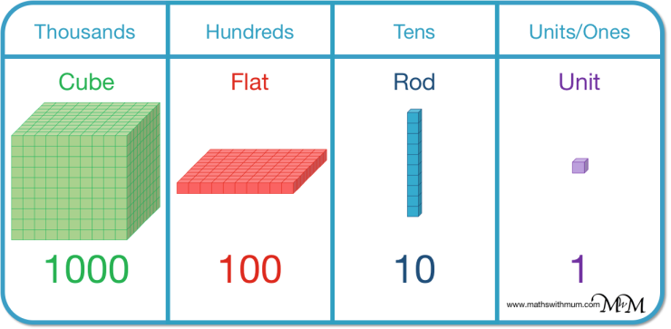
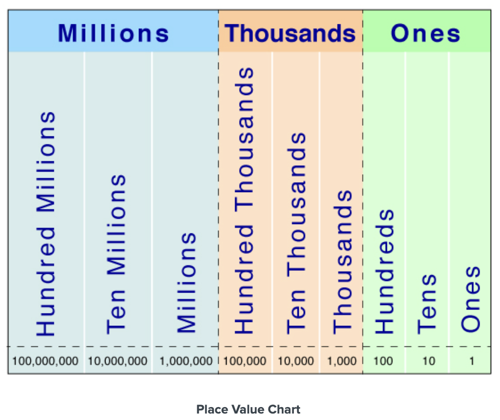

**Introduction**

Number systems exist because there's always been a need to quantify things. Whether we're wanting to know how much yield our crops produced, or how many Mega-Yachts a billionaire can buy, we need a systematic and accurate way to measure things.

Accurate, systematic and scalable, I'd argue.

History shows us that there have been multiple ways we as civilizations have tried to quantify things. We call these number systems.

For example, the Romans used the Roman numerals. These were simply symbols which represented quantities without a care for where a symbol may appear, which we'd call a non-positional number system.

Normally, as time went on we developed systems that were intuitive and scalable. After all, quantifying things is a major part of how we live. It's how we trade and how we keep score.

Roman numerals, for instance, make for clumsy and easily-messed-up arithmetic. In that number system every symbol always means a specific quantity, so `L` always means 50, `X` always means 10, `V` always means 5, no matter where they appear. So when writing LVIII (58) we're essentially saying "50 + 5 + 1 + 1 + 1".

That doesn't seem too terrible, does it? But it quickly crumbles down when making things a bit more complex. Let's introduce addition and see what happens.

Let's add 58 and 27, using Roman numerals

> 58 -> LVIII
> 27 -> XXVII

To add them by hand in Roman we'd combine the symbols, group them by their value, simplify the numbers, and finally re-write them. Like so;

> **Combining symbols**
>
> LVIII + XXVII = L V I I I X X V I I
>
> **Grouping by value**
>
> XX (10 + 10), VV (5 + 5), IIIII (1 + 1 + 1 + 1 + 1), L (50)
>
> **Simplifying the groups**
>
> VV = X
>
> IIIII = V
>
> So we really have L + XXX + V
>
> **Re-writing the number**
>
> LXXXV

It's easy to see how careful you have to be here. It's pretty easy to miss a symbol because it's repeated too many times and so you glanced over it, for instance.

This isn't a Roman history lesson though. I just exemplified through that to make the point that as a society we developed systems which made our lives much easier because of their accuracy, and scalability.

Funny enough, it's thought that the system that we most widely use in the world today, the base-10 or decimal system, is not bullet-proof superior to any other system in the world^[It's very good, but from what I've heard if you take out the argument that we have 10 fingers, it really has no more to show than say a base-12 system.], we just probably gravitated to it because, naturally, in early counting we pointed to our fingers, and there's 10 of them.

The fact of the matter though is that a system like base-10, which we'd call a positional system (because where a number sits matters), are much more efficient to do arithmetic with. Which is why it's stayed with us so long and why it's basically the base for how we do mathematics today.

**Rules and definitions**

What we called a positional number system we explain today in early mathematics teaching as place values.

Simply think of place value as the idea that wherever a digit sits on a number is what gives it its value.

It's the principle that tells us that the digit _"5"_ can have different values depending on its position. It can mean 5, it can mean 500, or it can mean 5,000,000, even though in the following numbers it looks like the same digit 5.

> **5** vs **5**67 vs **5**,943,321

To hammer the point home, note how the Roman numeral _"V"_ means exactly the same thing wherever it's written

> V = 5
>
> VI = 5 + 1
>
> XVI = 10 + 5 + 1

See how _"V"_ can be the only numeral, the second numeral, or the middle numeral in a number and it doesn't really matter, it always contributes five. Which means if I were to strip off every other numeral from the last two examples and just leave the numeral _"V"_ we'd still end with five.

This is completely different from what would happen in a positional (place value) system like base-10

> 5 = 5
>
> 51 = 50 + 1
>
> 567 = 500 + 60 + 7

Which shows us that if we strip every other digit but the 5's in our numbers, we get entirely different values.

> 5 ≠ 50 ≠ 500
> vs
> V = V = V.

Now, the way we distinguish whether a digit has one value or another is by following the rules of the base-10 (decimal) system. There are really just a couple of important ones.

1. We have ten different digits from which we construct all numbers. These are 0, 1, 2, 3, 4, 5, 6, 7, 8, 9.

2. Numbers are written as strings of these digits. Each position (place) in the string has a value: starting from the right, the first place counts ones, the next counts tens, then hundreds, thousands and so on, where each place is ten times the one to its right.

3. The value of a written number is the total you get by adding each digit multiplied by the value of its place. For instance, 956 means 9 hundreds (9 x 100) + 5 tens (5 x 10) + 6 ones (6 x 1)

4. Zero (0) is a special digit. When it appears inside a number (not at the far left), it shows that there are no units of that place value, but it still holds that place. For example, in 204, the 0 shows there are no tens, but it keeps the 2 in the hundreds place and the 4 in the ones place.

   A 0 at the far left of a number does not change its value (021 = 21), but adding a 0 to the right usually does change its value (21 is different from 210).

Below is a visual representation of the concept of rule #2; every time we move to the left in place we are having a number that is 10x greater in magnitude than the one to its right - and by contrast, if we move to the right, we have a number that is 1/10 of the number to its left.

See also the first nine place values and what we call them.

We can extend place values indefinitely to the left. Every new group of three places gets a new name, but within each group the pattern is the same: we have “name,” “ten name,” and “hundred name.” For example, after the millions places come the billions places: billions, tens of billions, and hundreds of billions.

**The important concept**

One of the essential reasons why understanding place value is important to be able to move on to other math topics are the concepts of borrowing and carrying - which will help us in things like subtraction and addition.

First, let's remember that any number can be broken down into its place value components, which is to say we can write numbers from standard form into expanded form. Like so

> 1,245 (Standard form)
>
> 1,000 + 200 + 40 + 5 (Expanded form)

Now, for simplification purposes, let's use a smaller number for our explanation.

Think of the number 30

> 30 is just 3 tens [(3 x 10) = (30)]
>
> 3 tens can also be written as 2 + 1 tens [(2 x 10) + (1 x 10) =(30)]
>
> 1 ten = 10 ones [(10 x 1) = 10]
>
> so 3 tens = 2 tens + 10 ones [(2 x 10) + (10 x 1) = (30)]

All we are doing here is simply re-writing numbers in equivalent manners in different place values. Another example is

> 700 is just 7 hundreds [(7 x 100) = (700)]
>
> 1 hundred = 100 ones [(100 x 1) = (100)]
>
> so 7 hundreds = 700 ones [(700 x 1) = (700)]

What we understand with these examples is that we can always re-write a number from a place value to a different one. We just have to take into account the magnitude of their relationship with one another.

This concept will be incredibly important when learning to apply the standard algorithms for both addition and subtraction.
